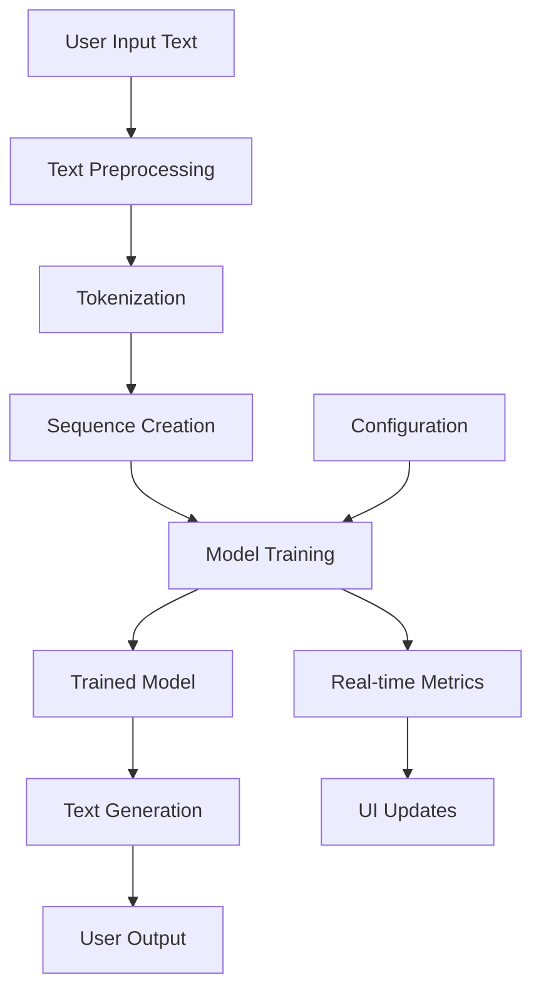

# AI Text Predictor

## Table of Contents

1. [Project Overview](#project-overview)
2. [Features](#features)
3. [Installation](#installation)
4. [Quick Start](#quick-start)
5. [Architecture](#architecture)
6. [User Guide](#user-guide)
7. [API Reference](#api-reference)
8. [Configuration](#configuration)
9. [Troubleshooting](#troubleshooting)
10. [Performance Optimization](#performance-optimization)
11. [Contributing](#contributing)
12. [License](#license)

---

## Project Overview

The **AI Text Predictor** is an advanced next-word prediction application built with modern deep learning techniques and deployed as an interactive Streamlit web application. It uses bidirectional LSTM networks with attention mechanisms to generate contextually aware text predictions.

### **Key Objectives**

- Provide an intuitive interface for training custom text prediction models
- Enable real-time text generation with controllable creativity
- Offer comprehensive analytics and visualization of model performance
- Support various text input methods and formats

### **Technology Stack**

- **Backend**: TensorFlow 2.x, Keras
- **Frontend**: Streamlit
- **Visualization**: Plotly, Matplotlib
- **Data Processing**: NumPy, Pandas
- **Language**: Python 3.8+

---

## Features

### **Core Features**

- **Advanced Neural Architecture**: Bidirectional LSTM with attention mechanisms
- **Interactive Training**: Real-time training progress with live metrics
- **Multiple Input Methods**: File upload, text paste, or sample data
- **Configurable Parameters**: Adjust model architecture without coding
- **Creative Text Generation**: Temperature and top-k sampling for varied outputs
- **Comprehensive Analytics**: Training curves, accuracy metrics, and probability distributions

### **User Interface Features**

- **Tabbed Interface**: Organized workflow from training to generation
- **Progress Tracking**: Real-time training progress bars and metrics
- **Interactive Charts**: Plotly visualizations for model analytics
- **Responsive Design**: Works on desktop and mobile devices
- **Professional Styling**: Custom CSS for enhanced user experience

### **Analytics Features**

- Training loss and accuracy curves
- Word probability distributions
- Model architecture visualization
- Performance metrics dashboard
- Export capabilities for trained models

---

## Installation

### Prerequisites

- Python 3.8 or higher
- pip package manager
- At least 4GB RAM (8GB recommended)
- Modern web browser

### Step 1: Clone or Download

```bash
# Option 1: Clone from repository
git clone https://github.com/your-username/ai-text-predictor.git
cd ai-text-predictor

# Option 2: Download and extract ZIP file
# Extract to your desired directory
```

### Step 2: Install Dependencies

```bash
# Install required packages
pip install streamlit tensorflow plotly pandas numpy scikit-learn matplotlib

# Or use requirements.txt (if provided)
pip install -r requirements.txt
```

### Step 3: Verify Installation

```bash
# Test TensorFlow installation
python -c "import tensorflow as tf; print(tf.__version__)"

# Test Streamlit installation
streamlit hello
```

### Optional: Virtual Environment Setup

```bash
# Create virtual environment
python -m venv ai-predictor-env

# Activate virtual environment
# Windows:
ai-predictor-env\Scripts\activate
# macOS/Linux:
source ai-predictor-env/bin/activate

# Install dependencies in virtual environment
pip install -r requirements.txt
```

---

## Quick Start

### 1. Launch the Application

```bash
streamlit run streamlit_app.py
```

The application will open in your default web browser at `http://localhost:8501`

### 2. Basic Usage Flow

1. **Configure Model** (Sidebar): Adjust parameters or use defaults
2. **Train Model** (Tab 1): Upload text or use sample data, click "Train Model"
3. **Generate Text** (Tab 2): Enter seed text and generate predictions
4. **View Analytics** (Tab 3): Examine training performance
5. **Model Info** (Tab 4): Review model architecture and statistics

### 3. Example Workflow

```python
# Example training text
text = """
Your training text goes here. The model will learn patterns
from this text to generate similar content. Provide at least
a few paragraphs for better results.
"""

# Steps:
# 1. Paste text in "Train Model" tab
# 2. Click "Train Model"
# 3. Wait for training completion
# 4. Go to "Generate Text" tab
# 5. Enter seed text like "the detective"
# 6. Click "Generate Text"
```

---

## Architecture

### **Neural Network Architecture**

The model uses a sophisticated deep learning architecture optimized for sequential text prediction:

```
Input Text → Tokenization → Embedding → Bi-LSTM → Layer Norm → Bi-LSTM → Dense → Dropout → Output
```

#### **Layer Details**

1. **Embedding Layer**: Converts tokens to dense vectors (128-300 dimensions)
2. **Bidirectional LSTM #1**: Processes sequences forward and backward (128-256 units)
3. **Layer Normalization**: Stabilizes training and improves convergence
4. **Bidirectional LSTM #2**: Additional sequence processing (64-128 units)
5. **Dense Layer**: Feature transformation (256 units, ReLU activation)
6. **Dropout Layer**: Regularization to prevent overfitting (0.3 rate)
7. **Output Layer**: Probability distribution over vocabulary (softmax activation)

### **Technical Components**

#### **Text Preprocessing Pipeline**

```python
Raw Text → Cleaning → Tokenization → Sequence Creation → Padding → Training Data
```

1. **Text Cleaning**: Remove unwanted characters, normalize whitespace
2. **Tokenization**: Convert text to numerical tokens
3. **Sequence Generation**: Create overlapping n-gram sequences
4. **Padding**: Ensure uniform sequence lengths
5. **Train/Test Split**: Separate data for validation

#### **Training Process**

```python
Data Preparation → Model Building → Training Loop → Validation → Best Model Selection
```

### **Data Flow Architecture**



---

## User Guide

### **Tab 1: Train Model**

#### **Input Methods**

1. **Upload Text File**

   - Supported formats: .txt
   - Recommended size: 10KB - 10MB
   - Encoding: UTF-8

2. **Paste Text**

   - Direct text input
   - Minimum: 500 words recommended
   - Maximum: Limited by available RAM

3. **Use Sample Text**
   - Pre-loaded Sherlock Holmes text
   - Good for testing and demonstrations

#### **Training Parameters**

- **Epochs**: Number of training iterations (5-50)
- **Batch Size**: Samples processed together (16, 32, 64, 128)
- **Validation Split**: Portion of data for validation (0.1-0.3)

#### **Training Process**

1. Click "Train Model" button
2. Monitor real-time progress bar
3. Watch live loss and accuracy metrics
4. Training automatically stops if no improvement
5. Best model weights are saved automatically

### **Tab 2: Generate Text**

#### **Text Generation Controls**

- **Seed Text**: Starting text for generation
- **Words to Generate**: Number of words to predict (1-20)
- **Creativity (Temperature)**: Controls randomness
  - Low (0.1-0.5): Conservative, predictable
  - Medium (0.6-1.0): Balanced creativity
  - High (1.1-2.0): Very creative, less predictable
- **Top-K Sampling**: Consider only top-k most likely words (5-50)
- **Number of Variations**: Generate multiple versions (1-5)

#### **Advanced Features**

- **Word Probabilities**: View likelihood of next words
- **Interactive Visualization**: Bar charts of word probabilities
- **Multiple Generations**: Compare different creative outputs

### **Tab 3: Analytics**

#### **Training Metrics**

- **Final Training Loss**: Model's prediction error
- **Final Training Accuracy**: Percentage of correct predictions
- **Training Curves**: Loss and accuracy over time
- **Interactive Charts**: Zoom, pan, and hover for details

#### **Performance Indicators**

- **Decreasing Loss**: Model is learning successfully
- **Increasing Accuracy**: Predictions are improving
- **Convergence**: Metrics stabilize over epochs
- **Overfitting Signs**: Training accuracy much higher than validation

### 💾 **Tab 4: Model Info**

#### **Architecture Details**

- Vocabulary size and coverage
- Model parameter count
- Layer configuration
- Memory usage estimation

#### **Model Summary**

- Detailed layer-by-layer breakdown
- Parameter counts per layer
- Output shapes and connections

---

## API Reference

### **StreamlitNLPPredictor Class**

#### **Initialization**

```python
predictor = StreamlitNLPPredictor(
    vocab_size=5000,        # Maximum vocabulary size
    embedding_dim=128,      # Embedding layer dimension
    lstm_units=128,         # LSTM hidden units
    max_seq_length=30,      # Maximum sequence length
    dropout_rate=0.3        # Dropout rate for regularization
)
```

#### **Core Methods**

##### **prepare_data(text)**

Preprocesses raw text and creates training sequences.

- **Parameters**:
  - `text` (str): Raw input text
- **Returns**:
  - `X` (np.array): Input sequences
  - `y` (np.array): Target sequences (one-hot encoded)

##### **build_model()**

Constructs the neural network architecture.

- **Returns**: Compiled Keras model

##### **train_with_progress(X, y, epochs, batch_size, validation_split)**

Trains the model with Streamlit progress tracking.

- **Parameters**:
  - `X` (np.array): Input training data
  - `y` (np.array): Target training data
  - `epochs` (int): Number of training epochs
  - `batch_size` (int): Batch size for training
  - `validation_split` (float): Fraction of data for validation
- **Returns**: Training history and metrics

##### **predict_next_words(seed_text, n_words, temperature, top_k)**

Generates text predictions.

- **Parameters**:
  - `seed_text` (str): Starting text
  - `n_words` (int): Number of words to generate
  - `temperature` (float): Sampling temperature
  - `top_k` (int): Top-k sampling parameter
- **Returns**: Generated text string

##### **get_word_probabilities(seed_text, top_n)**

Returns probability distribution for next words.

- **Parameters**:
  - `seed_text` (str): Context text
  - `top_n` (int): Number of top predictions to return
- **Returns**: List of (word, probability) tuples

### **Configuration Parameters**

#### **Model Architecture**

```python
# Vocabulary and Embedding
vocab_size: int = 5000          # Size of vocabulary
embedding_dim: int = 128        # Embedding vector dimension

# LSTM Configuration
lstm_units: int = 128           # Hidden units in LSTM layers
max_seq_length: int = 30        # Maximum input sequence length
dropout_rate: float = 0.3       # Dropout regularization rate

# Training Parameters
epochs: int = 15                # Training epochs
batch_size: int = 32            # Batch size
validation_split: float = 0.2   # Validation data fraction
```

#### **Generation Parameters**

```python
# Text Generation
temperature: float = 0.8        # Sampling temperature
top_k: int = 10                 # Top-k sampling
n_words: int = 5                # Words to generate
num_variations: int = 3         # Number of variations
```

---

## Configuration

### **Environment Variables**

Set these before running the application:

```bash
# Suppress TensorFlow messages
export TF_CPP_MIN_LOG_LEVEL=3

# Optional: Disable oneDNN optimizations
export TF_ENABLE_ONEDNN_OPTS=0

# Set memory growth for GPU (if available)
export TF_FORCE_GPU_ALLOW_GROWTH=true
```

### **Streamlit Configuration**

Create `.streamlit/config.toml`:

```toml
[server]
port = 8501
headless = false
enableCORS = false
enableXsrfProtection = false

[browser]
gatherUsageStats = false

[theme]
primaryColor = "#1f77b4"
backgroundColor = "#ffffff"
secondaryBackgroundColor = "#f0f2f6"
textColor = "#262730"
```

### **Model Configuration Presets**

#### **Fast Training (Development)**

```python
vocab_size = 2000
embedding_dim = 64
lstm_units = 64
max_seq_length = 20
epochs = 10
```

#### **Balanced Performance (Production)**

```python
vocab_size = 5000
embedding_dim = 128
lstm_units = 128
max_seq_length = 30
epochs = 20
```

#### **High Quality (Research)**

```python
vocab_size = 10000
embedding_dim = 256
lstm_units = 256
max_seq_length = 50
epochs = 50
```

---

## Troubleshooting

### **Common Issues and Solutions**

#### **Installation Issues**

**Problem**: `ModuleNotFoundError: No module named 'tensorflow'`

```bash
# Solution: Install TensorFlow
pip install tensorflow
# For M1 Macs:
pip install tensorflow-macos
```

**Problem**: `ImportError: cannot import name 'plotly'`

```bash
# Solution: Install Plotly
pip install plotly
```

#### **Training Issues**

**Problem**: "No valid sequences created"

- **Cause**: Input text too short or heavily filtered
- **Solution**: Provide at least 1000 words of training text

**Problem**: Training very slow

- **Cause**: Large model or insufficient hardware
- **Solutions**:
  - Reduce `vocab_size` and `lstm_units`
  - Decrease `max_seq_length`
  - Use smaller `batch_size`

**Problem**: Model accuracy stuck at low values

- **Causes**: Insufficient data, poor text quality, or model too simple
- **Solutions**:
  - Provide more training data
  - Increase model complexity
  - Clean input text better

#### **Generation Issues**

**Problem**: Generated text is repetitive

- **Cause**: Low temperature, poor training
- **Solutions**:
  - Increase temperature (0.8-1.2)
  - Use higher top-k values
  - Train with more diverse data

**Problem**: Generated text is nonsensical

- **Cause**: High temperature, insufficient training
- **Solutions**:
  - Lower temperature (0.3-0.7)
  - Train for more epochs
  - Use more training data

#### **Memory Issues**

**Problem**: Out of memory during training

```python
# Solutions:
# 1. Reduce batch size
batch_size = 16  # Instead of 64

# 2. Reduce vocabulary size
vocab_size = 2000  # Instead of 10000

# 3. Reduce sequence length
max_seq_length = 20  # Instead of 50
```

**Problem**: Streamlit app becomes unresponsive

- **Cause**: Large model or long training
- **Solutions**:
  - Use smaller model parameters
  - Reduce training epochs
  - Restart the Streamlit app

### **Performance Issues**

#### **Slow Training**

```python
# Optimization strategies:
# 1. Use smaller architecture
lstm_units = 64
embedding_dim = 64

# 2. Reduce sequence length
max_seq_length = 20

# 3. Increase batch size (if memory allows)
batch_size = 64

# 4. Enable mixed precision (advanced)
from tensorflow.keras import mixed_precision
mixed_precision.set_global_policy('mixed_float16')
```

#### **Slow Text Generation**

- Reduce vocabulary size
- Use smaller model architecture
- Lower the number of generated words

### **Debug Mode**

Enable detailed logging:

```python
import logging
logging.basicConfig(level=logging.DEBUG)

# Add to your code for debugging
import tensorflow as tf
tf.debugging.set_log_device_placement(True)
```

---

## Performance Optimization

### **Training Optimization**

#### **Hardware Acceleration**

```python
# Check GPU availability
import tensorflow as tf
print("GPU Available: ", tf.config.list_physical_devices('GPU'))

# Enable memory growth
gpus = tf.config.experimental.list_physical_devices('GPU')
if gpus:
    tf.config.experimental.set_memory_growth(gpus[0], True)
```

#### **Model Architecture Tuning**

```python
# Performance vs Quality trade-offs:

# Fast Training (< 2 minutes)
vocab_size = 1000
lstm_units = 32
epochs = 5

# Balanced (5-10 minutes)
vocab_size = 3000
lstm_units = 64
epochs = 15

# High Quality (20+ minutes)
vocab_size = 8000
lstm_units = 128
epochs = 30
```

#### **Data Optimization**

```python
# Efficient data handling:
# 1. Use generator for large datasets
def data_generator(sequences, batch_size):
    for i in range(0, len(sequences), batch_size):
        yield sequences[i:i+batch_size]

# 2. Preprocess text efficiently
import re
def fast_clean_text(text):
    # Optimized regex operations
    text = re.sub(r'\s+', ' ', text.lower())
    return re.sub(r'[^\w\s.,!?]', '', text)
```

### **Inference Optimization**

#### **Batch Prediction**

```python
def predict_batch(seed_texts, n_words=5):
    """Predict multiple texts efficiently"""
    results = []
    for seed in seed_texts:
        result = predictor.predict_next_words(seed, n_words)
        results.append(result)
    return results
```

#### **Caching Strategy**

```python
from functools import lru_cache

@lru_cache(maxsize=128)
def cached_prediction(seed_text, n_words, temperature):
    """Cache frequent predictions"""
    return predictor.predict_next_words(seed_text, n_words, temperature)
```

### **Memory Management**

#### **Memory-Efficient Training**

```python
# Clear unnecessary variables
import gc

def cleanup_memory():
    gc.collect()
    tf.keras.backend.clear_session()

# Use after training
cleanup_memory()
```

#### **Monitoring Memory Usage**

```python
import psutil
import os

def get_memory_usage():
    process = psutil.Process(os.getpid())
    return process.memory_info().rss / 1024 / 1024  # MB

print(f"Memory usage: {get_memory_usage():.2f} MB")
```

---

## Contributing

### **How to Contribute**

1. **Fork the Repository**
2. **Create Feature Branch**
   ```bash
   git checkout -b feature/amazing-feature
   ```
3. **Make Changes**
4. **Add Tests**
5. **Submit Pull Request**

### **Development Setup**

```bash
# Clone your fork
git clone https://github.com/your-username/ai-text-predictor.git

# Install development dependencies
pip install -r requirements-dev.txt

# Run tests
python -m pytest tests/

# Run linting
flake8 src/
black src/
```

### **Testing Guidelines**

```python
# Example test structure
import unittest
from src.predictor import StreamlitNLPPredictor

class TestPredictor(unittest.TestCase):
    def setUp(self):
        self.predictor = StreamlitNLPPredictor()

    def test_text_preprocessing(self):
        text = "Hello, World! This is a test."
        processed = self.predictor.preprocess_text(text)
        self.assertIsInstance(processed, list)
        self.assertGreater(len(processed), 0)
```

---
